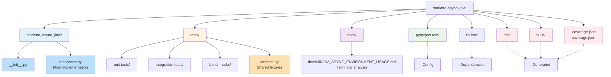

# Repository Guidelines

Contributors keep `starlette-async-jinja` fast, typed, and async-native; follow these practices to stay aligned.

## Project Structure & Module Organization

**Directory Legend:**

| Directory | Purpose | Color |
|-----------|---------|-------|
| **starlette_async_jinja/** | Core library code | 🔵 Blue |
| **tests/** | Test suites (unit, integration, benchmark) | 🟠 Orange |
| **docs/** | Technical documentation | 🟣 Purple |
| **pyproject.toml** | Build metadata, dependencies, tools | 🟢 Green |
| **uv.lock** | Pinned dependency versions | 🟢 Green |
| **dist/, build/** | Generated build artifacts | 🔴 Red (generated) |
| **coverage files** | Test coverage reports | 🔴 Red (generated) |

**Key Module Responsibilities:**

- `starlette_async_jinja/__init__.py` - Public API exports
- `starlette_async_jinja/responses.py` - Main implementation with `AsyncJinja2Templates`, caching utilities, and `JsonResponse`
- `tests/conftest.py` - Pytest fixtures for test isolation
- `tests/` - Async unit, integration, and benchmark suites; place new cases alongside the feature under test
- `pyproject.toml` - Captures build metadata, Ruff settings, pytest defaults, and dependency groups; `uv.lock` pins versions for reproducible installs
- Generated artefacts such as `dist/`, `build/`, and coverage outputs stay out of authored changes

## Build, Test, and Development Commands

- `uv sync` installs or updates the virtual environment from `pyproject.toml` and `uv.lock`.
- `uv run pytest` executes the full suite with coverage thresholds configured in `pyproject.toml`.
- `uv run pytest -m unit` / `integration` / `benchmark` targets marker-specific subsets during focused work.
- `uv run ruff check .` and `uv run ruff format .` enforce linting and formatting (line length 88, Google-style docstrings).
- `uv run pyright` validates typing; `uv run bandit -c pyproject.toml` covers security scanning before release.

## Coding Style & Naming Conventions

- Target Python 3.13+ with strict type hints; prefer `typing.TypeAlias`, `t.cast`, and async-friendly APIs such as `anyio.AsyncPath`.
- Use four-space indentation, trailing commas in multi-line literals, and descriptive function names mirroring Starlette conventions (`render_fragment`, `TemplateResponse`).
- Tests follow `test_*.py`, `Test*` class names, and pytest fixture scoping already defined in `conftest.py`.
- Keep public exports consolidated in `__all__` inside `starlette_async_jinja/__init__.py`.

## Testing Guidelines

- Pytest defaults enforce `--cov=starlette_async_jinja --cov-fail-under=42`; leave coverage configuration in `pyproject.toml`.
- Apply `@pytest.mark.unit` / `integration` / `benchmark` markers to keep targeted runs working.
- Prefer async tests with `pytest.mark.asyncio` and reuse shared fixtures; avoid sleeps—use `anyio` clocks or monkeypatching instead.
- Document new fixtures or helpers inline and add regression cases mirroring discovered bugs.

## Commit & Pull Request Guidelines

- Follow Conventional Commit style (`type(scope): summary`), matching history such as `test(config): update 5 files`.
- Before opening a PR, run lint, type, and test commands locally and paste the `uv run pytest` summary plus notable tool output into the description.
- Reference linked issues, note behavioural changes, and include screenshots or trace snippets when altering response payloads or template rendering paths.
- Keep PRs focused; cross-reference follow-up ideas rather than bundling unrelated refactors.
