# starlette-async-jinja

[](https://github.com/lesleslie/crackerjack)
[](https://www.python.org/downloads/)


An asynchronous Jinja2 template integration for Starlette and FastAPI, built on top of the `jinja2-async-environment` package.

## Features

- **Fully async template rendering** - Load templates and render them asynchronously
- **Seamless framework integration** - Works with Starlette and FastAPI request/response cycles
- **Template fragments** - Render specific blocks from templates
- **Template partials** - Include sub-templates with their own context using `render_block`
- **Fast JSON responses** - Enhanced JSON responses using `msgspec` for faster serialization
- **Context processors** - Add global context to all templates
- **Performance optimizations** - Context processor caching, fragment caching, and memory pooling
- **Configurable caching** - Fine-tune cache sizes and TTL for optimal performance

## Installation

```bash
pip install starlette-async-jinja
```

## Template Rendering Pipeline

The following diagram shows how a request flows through the async template rendering system:


**Key Flow Steps:**

1. **Request Processing**: Route handler receives request and calls template rendering
1. **Context Preparation**: Context processors add global variables (with caching)
1. **Template Loading**: Template loaded asynchronously from filesystem
1. **Rendering**: Template rendered using async generator pattern for inheritance support
1. **Response**: HTML content wrapped in Starlette TemplateResponse object

**Performance Optimizations Applied:**

- 🟡 **Context Processor Cache**: Reuses processor results by path/method
- 🟣 **Fragment Block Cache**: Caches compiled block functions
- 🔵 **Context Object Pooling**: Reuses context dictionaries
- 🟢 **Async I/O**: All filesystem operations are non-blocking

## Requirements

- Python 3.13+
- Starlette
- Jinja2
- jinja2-async-environment
- anyio
- msgspec

## Basic Usage

### Starlette Example

```python
from starlette.applications import Starlette
from starlette.routing import Route
from anyio import Path as AsyncPath
from starlette_async_jinja import AsyncJinja2Templates

# Initialize templates with an async path
templates = AsyncJinja2Templates(directory=AsyncPath("templates"))


async def homepage(request):
    return await templates.TemplateResponse(
        request, "index.html", {"message": "Hello, world!"}
    )


# Or using the alias
async def about(request):
    return await templates.render_template(
        request, "about.html", {"message": "About page"}
    )


# Define routes
app = Starlette(routes=[Route("/", homepage), Route("/about", about)])
```

### FastAPI Example

```python
from fastapi import FastAPI, Request
from fastapi.responses import HTMLResponse
from anyio import Path as AsyncPath
from starlette_async_jinja import AsyncJinja2Templates, JsonResponse

app = FastAPI()

# Initialize templates with an async path
templates = AsyncJinja2Templates(directory=AsyncPath("templates"))


@app.get("/", response_class=HTMLResponse)
async def homepage(request: Request):
    """Render the homepage template."""
    return await templates.TemplateResponse(
        request,
        "index.html",
        {
            "title": "FastAPI with Async Jinja2",
            "message": "Welcome to FastAPI with async template rendering!",
        },
    )


@app.get("/about", response_class=HTMLResponse)
async def about(request: Request):
    """Render the about page template."""
    return await templates.render_template(
        request,
        "about.html",
        {"title": "About Us", "message": "Learn more about our company"},
    )


@app.get("/api/data")
async def get_data():
    """Return JSON data using the optimized JsonResponse."""
    return JsonResponse(
        {
            "items": [
                {"id": 1, "name": "Item 1"},
                {"id": 2, "name": "Item 2"},
                {"id": 3, "name": "Item 3"},
            ]
        }
    )
```

## Using Template Partials with `render_block`

The `render_block` feature allows you to render entire template files as reusable components, inspired by [jinja_partials](https://github.com/mikeckennedy/jinja_partials). This is especially useful for creating modular template components.

### Component Templates

**templates/components/alert.html**

```html
<div class="alert alert-{{ type | default('info') }}">
    <h4 class="alert-heading">{{ title }}</h4>
    <p>{{ message }}</p>
    
    <button type="button" class="close" data-dismiss="alert">×</button>
    
</div>
```

### Using Components in Your Templates

**templates/index.html**

```html



<div class="container">
    <h1>Welcome to {{ site_name }}</h1>

    {# Instead of a macro, use render_block #}
    {{ render_block('components/alert.html',
                     type='warning',
                     title='Attention!',
                     message='This is an important notice.',
                     dismissible=True) }}

    
        {# Another component rendered with render_block #}
        {{ render_block('components/card.html',
                         title=item.title,
                         content=item.description,
                         image_url=item.image) }}
    
</div>

```

### Important Notes on `render_block`

- Each component only receives the variables explicitly passed to it
- `render_block` renders entire template files as components
- The `markup=True` parameter (default) ensures proper HTML escaping

## Context Processors

Context processors allow you to add global context to all templates:

```python
def global_context(request):
    return {"site_name": "My Awesome Site", "current_year": 2024}


templates = AsyncJinja2Templates(
    directory=AsyncPath("templates"), context_processors=[global_context]
)

# Now all templates will have access to site_name and current_year
```

### Context Processors with FastAPI

```python
from fastapi import FastAPI, Request
from anyio import Path as AsyncPath
from starlette_async_jinja import AsyncJinja2Templates

app = FastAPI()


# Define context processors
def global_context(request):
    return {"site_name": "My FastAPI App", "current_year": 2024, "version": "1.0.0"}


def user_context(request):
    # In a real app, you might get this from a session or JWT
    return {"user": {"name": "Guest User"}}


# Initialize templates with context processors
templates = AsyncJinja2Templates(
    directory=AsyncPath("templates"), context_processors=[global_context, user_context]
)


@app.get("/")
async def homepage(request: Request):
    # These variables will be automatically available in all templates:
    # - site_name
    # - current_year
    # - version
    # - user
    return await templates.TemplateResponse(
        request, "index.html", {"title": "Home Page"}
    )
```

## Using Template Fragments

Fragments allow you to render specific blocks from within a template:

```html
<!-- In your template (page.html) -->

  <h1>Welcome to {{ site_name }}</h1>



  <footer>© {{ year }} {{ company_name }}</footer>

```

### Starlette Example

```python
from starlette.responses import HTMLResponse


# In your route handler:
async def render_header(request):
    content = await templates.render_fragment(
        "page.html", "header", site_name="My Awesome Site"
    )
    return HTMLResponse(content)
```

### FastAPI Example

```python
from fastapi import FastAPI, Request
from fastapi.responses import HTMLResponse

app = FastAPI()
templates = AsyncJinja2Templates(directory=AsyncPath("templates"))


@app.get("/header", response_class=HTMLResponse)
async def get_header(request: Request):
    """Return just the header fragment."""
    content = await templates.render_fragment(
        "page.html", "header", site_name="My FastAPI Site"
    )
    return HTMLResponse(content)


@app.get("/footer", response_class=HTMLResponse)
async def get_footer(request: Request):
    """Return just the footer fragment."""
    content = await templates.render_fragment(
        "page.html", "footer", year=2024, company_name="My Company"
    )
    return HTMLResponse(content)
```

## JsonResponse

Enhanced JSON response using `msgspec` for faster serialization:

```python
from starlette_async_jinja import JsonResponse


# Starlette example
async def api_endpoint(request):
    data = {"name": "John", "email": "john@example.com"}
    return JsonResponse(data)


# FastAPI example
@app.get("/api/user")
async def get_user():
    data = {"name": "John", "email": "john@example.com"}
    return JsonResponse(data)  # Faster than FastAPI's default JSONResponse
```

## Jinja2 Macros Support

Jinja2 macros are fully supported in async templates with the updated `jinja2-async-environment>=0.13`:

```html
<!-- templates/components.html -->

<div class="alert alert-{{ type }}">{{ message }}</div>



<button class="btn btn-{{ style }}">{{ text }}</button>

```

### Using Macros in Templates

Macros work seamlessly with `render_block` when called within templates:

```html
<!-- templates/page.html -->


<h1>Welcome!</h1>
{{ alert('info', 'Welcome to our site!') }}
{{ button('Get Started', 'success') }}
```

```python
# This works perfectly with macros inside
content = await templates.render_block("page.html", {})
```

### Direct Macro Access

For advanced use cases, macros can be called directly from template modules:

```python
async def render_macro_component():
    template = await templates.env.get_template_async("components.html")
    module = await template.make_module_async()

    # Call macro directly and await the result
    alert_html = await module.alert("warning", "Direct macro call")
    return alert_html
```

### Choosing Your Approach

- **Macros**: Traditional Jinja2 components defined within templates, great for simple reusable elements
- **render_block**: Renders entire template files as components, useful for complex reusable template partials
- **render_fragment**: Renders specific named blocks from templates, ideal for partial page updates

## Issues and Limitations

- Only [asynchronous template loaders](https://github.com/lesleslie/jinja2-async-environment/tree/main/jinja2_async_environment/loaders) are fully supported
- The Jinja bytecodecache requires an asynchronous Redis backend

## API Reference

### AsyncJinja2Templates Class Architecture


**Class Relationships:**

- **AsyncJinja2Templates** → Creates **JsonResponse** instances for JSON data
- **AsyncJinja2Templates** → Raises **BlockNotFoundError** when fragment blocks don't exist

**Key Methods by Category:**

| Category | Methods | Purpose |
|----------|---------|---------|
| **Template Rendering** | `TemplateResponse()`, `render_template()` | Render full templates to HTTP responses |
| **Fragment Rendering** | `render_fragment()`, `render_block()` | Render template blocks/partials |
| **Template Management** | `get_template_async()` | Load templates asynchronously |
| **Internal** | `_parse_template_args()`, `_prepare_template_context()` | Prepare data for rendering |
| **Caching** | `_get_context_from_cache()`, `_store_context_in_cache()` | Manage context processor cache |
| **Block Compilation** | `_get_or_compile_block()` | Cache compiled block functions |

### AsyncJinja2Templates Constructor

```python
templates = AsyncJinja2Templates(
    directory=AsyncPath("templates"),
    context_processors=[global_context],
    # Performance optimization options
    context_cache_size=128,  # Context processor cache size
    context_cache_ttl=300.0,  # Context cache TTL (seconds)
    fragment_cache_size=64,  # Fragment block cache size
    fragment_cache_ttl=600.0,  # Fragment cache TTL (seconds)
    context_pool_size=10,  # Context object pool size
    fragment_stringio_threshold=1024,  # StringIO threshold for large fragments
    # Standard Jinja2 environment options can be passed as keyword arguments
    autoescape=True,
    # Example: bytecode_cache=bytecode_cache,
    # Example: loader=custom_loader,
    **env_options,
)
```

#### Methods

- `async TemplateResponse(request, name, context={}, status_code=200, headers=None, media_type=None, background=None)` - Render a template to a response
- `async render_template(request, name, context={}, status_code=200, headers=None, media_type=None, background=None)` - Alias for TemplateResponse
- `async render_fragment(template_name, block_name, **kwargs)` - Render a specific block from a template
- `async render_block(template_name, markup=True, **data)` - Render a template as a partial with optional markup escaping (default: True)
- `async get_template_async(name)` - Get a template by name

### JsonResponse

Enhanced JSON response using `msgspec` for faster serialization.

### BlockNotFoundError

Exception raised when attempting to render a template block that doesn't exist.

### Fragment Rendering Optimizations

Fragment rendering includes several optimizations:

- **Block function caching** - Compiled block functions are cached to avoid re-extraction
- **Context object pooling** - Context dictionaries are reused to reduce memory allocations
- **Adaptive string building** - Large fragments use StringIO for better performance

```python
# Fragments are automatically optimized
content = await templates.render_fragment(
    "components/card.html",
    "card_block",
    title="Product Name",
    description="Product description...",
)
```

## Performance Optimization Architecture

The library implements a multi-layered optimization system for maximum performance:

```mermaid
flowchart TB
    subgraph Request["📥 Request Processing"]
        A[HTTP Request Received]
    end

    subgraph Layer1["🟡 Layer 1: Context Processor Cache"]
        direction LR
        B1[Generate Cache Key<br/>path + method]
        B2{Cache Hit?}
        B3[✓ Use Cached Context]
        B4[✗ Execute Processors<br/>Store in Cache]
        B1 --> B2
        B2 -->|Yes| B3
        B2 -->|No| B4
    end

    subgraph Layer2["🟣 Layer 2: Fragment Block Cache"]
        direction LR
        C1[Extract Block Function]
        C2{Block Cached?}
        C3[✓ Use Cached Function]
        C4[✗ Compile & Cache Block]
        C1 --> C2
        C2 -->|Yes| C3
        C2 -->|No| C4
    end

    subgraph Layer3["🔵 Layer 3: Context Object Pool"]
        direction LR
        D1[Need Context Dict?]
        D2{Pool Available?}
        D3[✓ Reuse from Pool]
        D4[✗ Create New Context]
        D1 --> D2
        D2 -->|Yes| D3
        D2 -->|No| D4
    end

    subgraph Layer4["🟢 Layer 4: Adaptive String Building"]
        direction LR
        E1[Estimate Output Size]
        E2{Size > Threshold?}
        E3[✓ Use StringIO<br/>Better for large output]
        E4[✗ Use List Concat<br/>Better for small output]
        E1 --> E2
        E2 -->|Yes| E3
        E2 -->|No| E4
    end

    subgraph Response["📤 Response Generation"]
        F[Return Optimized HTML]
    end

    A --> Layer1
    Layer1 --> Layer2
    Layer2 --> Layer3
    Layer3 --> Layer4
    Layer4 --> F

    style Layer1 fill:#fff9c4
    style Layer2 fill:#f3e5f5
    style Layer3 fill:#e1f5fe
    style Layer4 fill:#e8f5e9
    style A fill:#eceff1
    style F fill:#c8e6c9
```



**Optimization Layer Details:**

| Layer | Cache Type | Default Config | Benefit |
|-------|-----------|----------------|---------|
| **🟡 Context Processor Cache** | LRU with TTL | 128 entries, 300s TTL | Avoids redundant processor execution |
| **🟣 Fragment Block Cache** | LRU with TTL | 64 entries, 600s TTL | Skips block function extraction |
| **🔵 Context Object Pool** | Object pool | 10 contexts | Reduces memory allocations |
| **🟢 Adaptive String Building** | Size-based | 1024 byte threshold | Optimizes string concatenation |

**Cache Management:**

- **Automatic Eviction**: Oldest entries removed first when cache is full
- **TTL-based Invalidation**: Stale entries expire automatically
- **Configurable Sizes**: Tune cache sizes based on application needs
- **Thread-Safe**: All caches are safe for concurrent access

**Configuration Example:**

```python
templates = AsyncJinja2Templates(
    directory=AsyncPath("templates"),
    # Increase cache sizes for high-traffic apps
    context_cache_size=256,      # More context variations
    context_cache_ttl=600.0,     # Longer cache lifetime
    fragment_cache_size=128,     # More fragment types
    fragment_cache_ttl=1200.0,   # Cache fragments longer
    context_pool_size=20,        # More concurrent renders
    fragment_stringio_threshold=2048,  # Larger threshold
)
```

## Advanced Usage

### With Redis Bytecode Caching

For production environments, you can use Redis for bytecode caching:

```python
from anyio import Path as AsyncPath
from starlette_async_jinja import AsyncJinja2Templates
from jinja2_async_environment.bccache import AsyncRedisBytecodeCache
import redis.asyncio as redis

# Create a Redis client
redis_client = redis.Redis(host="localhost", port=6379, db=0)

# Set up bytecode caching
bytecode_cache = AsyncRedisBytecodeCache(redis_client, prefix="jinja2_")

# Create templates with caching
templates = AsyncJinja2Templates(
    directory=AsyncPath("templates"),
    bytecode_cache=bytecode_cache,  # Pass as env_options
)
```

### Using Different Loaders

You can use different loader types from `jinja2-async-environment`:

```python
from anyio import Path as AsyncPath
from starlette_async_jinja import AsyncJinja2Templates
from jinja2_async_environment.loaders import (
    AsyncFileSystemLoader,
    AsyncPackageLoader,
    AsyncChoiceLoader,
)

# Load templates from filesystem
fs_loader = AsyncFileSystemLoader("templates")

# Load templates from a Python package
package_loader = AsyncPackageLoader("your_package", "templates")

# Create a loader that tries multiple sources
choice_loader = AsyncChoiceLoader(
    [
        fs_loader,  # First try the filesystem
        package_loader,  # Then try the package
    ]
)

# Create templates with the choice loader
templates = AsyncJinja2Templates(
    directory=AsyncPath("templates"),  # This is still required
    loader=choice_loader,  # Pass as env_options
)
```

## Type Annotations

This package is fully typed with Python's type annotations and is compatible with static type checkers like mypy and pyright.

## Acknowledgements

- [jinja_partials](https://github.com/mikeckennedy/jinja_partials)
- [jinja2-fragments](https://github.com/sponsfreixes/jinja2-fragments)
- [jinja2-async-environment](https://github.com/lesleslie/jinja2-async-environment)

## License

BSD-3-Clause
